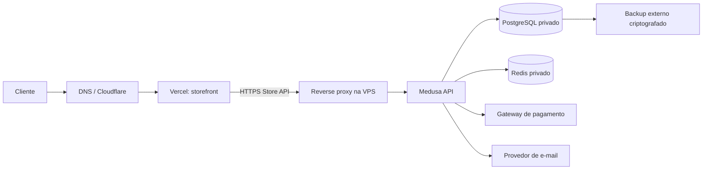
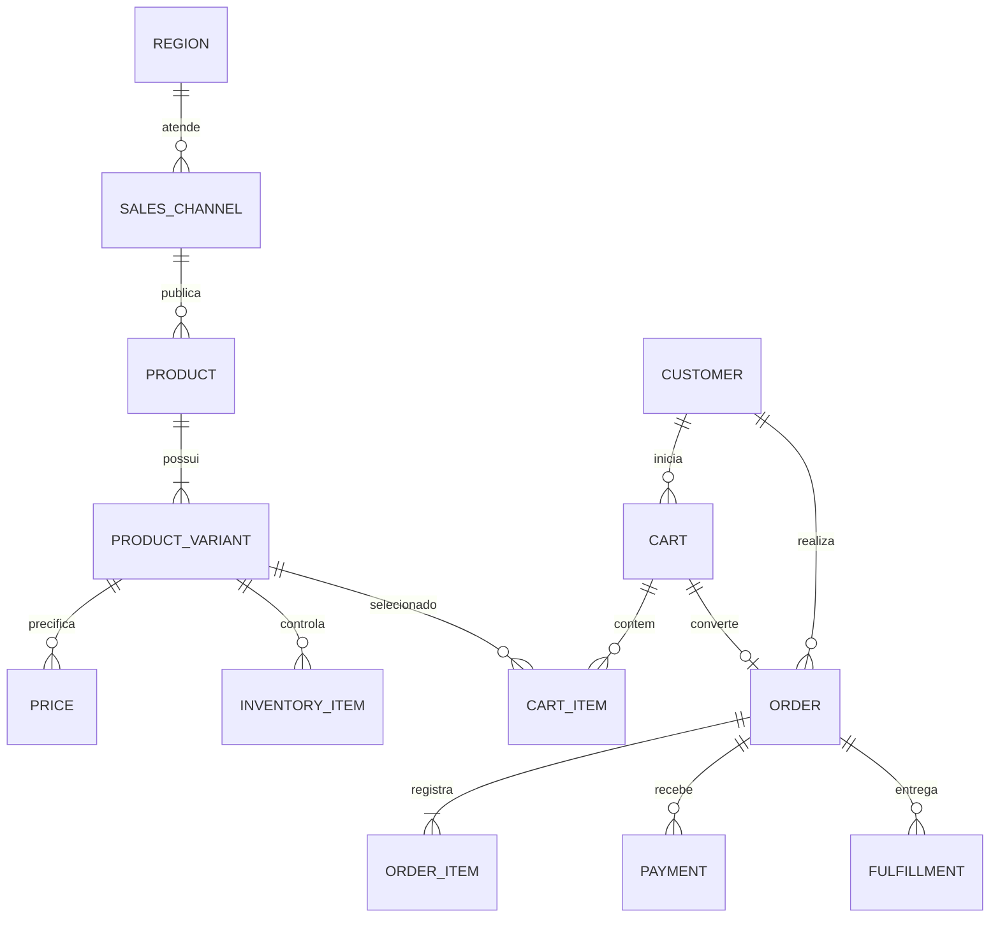

# Infraestrutura de produção — Silva Móveis

Status: base versionada e validável localmente. A promoção na VPS só é concluída após registrar evidências no checklist.

## Topologia



Regras: o navegador nunca acessa PostgreSQL/Redis; o Medusa é a fonte de verdade de catálogo, estoque, clientes, carrinhos e pedidos; Vercel entrega a interface; a VPS hospeda API e dados operacionais.

## Modelo de dados operacional



Não criar tabelas paralelas para substituir entidades nativas do Medusa. Extensões próprias devem ter migration, chave estável, auditoria e relação explícita com a entidade Medusa.

## Produção Docker

- Use `docker-compose.prod.yml` com `.env.production` fora do Git.
- PostgreSQL e Redis não publicam portas para a internet.
- Medusa fica disponível apenas em `127.0.0.1:9000` para o reverse proxy.
- Volumes `silva_medusa_postgres_data` e `silva_medusa_redis_data` são persistentes.
- Logs têm rotação de 20 MB por arquivo e 5 arquivos.
- O storefront Docker é perfil opcional `staging`; produção fica na Vercel.

Comandos de operação:

```bash
docker compose --env-file .env.production -f docker-compose.prod.yml config --quiet
docker compose --env-file .env.production -f docker-compose.prod.yml up -d postgres redis
docker compose --env-file .env.production -f docker-compose.prod.yml run --rm medusa medusa db:migrate
docker compose --env-file .env.production -f docker-compose.prod.yml up -d --build medusa
./ops/healthcheck-vps.sh
./ops/backup-postgres.sh
```

## Segurança e continuidade

- Firewall: somente SSH restrito, HTTP/HTTPS do reverse proxy; nunca 5432/6379.
- `.env.production`: usuário operacional, `chmod 600`, sem commit.
- Backup diário local + cópia externa; retenção mínima sugerida: 14 dias.
- Restore deve ser testado em banco separado antes de declarar a rotina confiável.
- Health check deve ser monitorado por serviço externo; container saudável sozinho não detecta DNS, TLS ou indisponibilidade do provedor.
- Rate limit deve existir no Cloudflare/reverse proxy para login, checkout, webhook e endpoints administrativos.
- Rollback: manter a imagem/commit anterior até o smoke test pós-deploy; nunca apagar volumes para corrigir migration.

## Critério de fechamento do capítulo

O capítulo só fica “concluído” com evidência da VPS para: `compose config`, portas públicas, volumes, migration, health check, backup, restore, firewall, TLS, logs, monitoramento, rate limit e rollback. A base deste repositório não substitui esses testes no servidor real.
